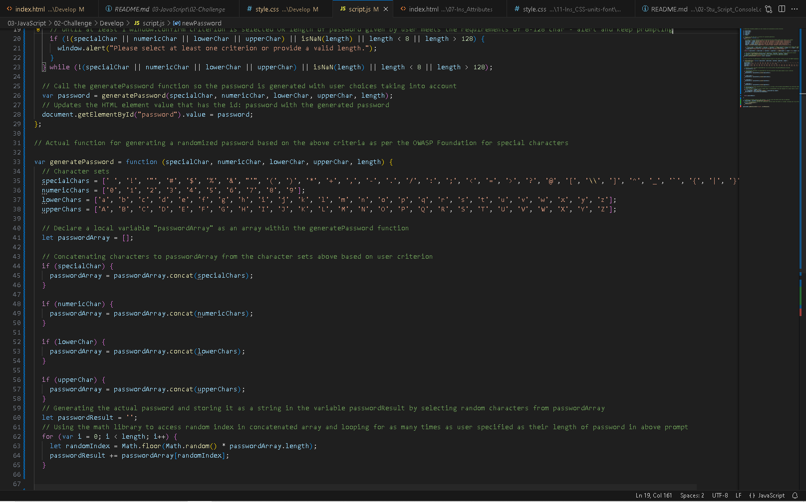
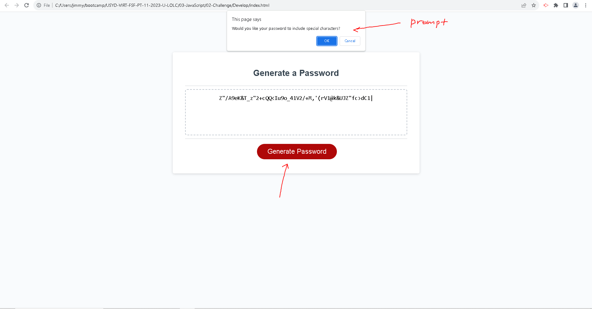

# Random-Password-Generator
## Codebase for a random password generator

## Description
The purpose of this project was to create a reliable password generator for those needing a new and secure password. Starter HTML and CSS were provided to serve as the base of the application, with no built-in functionality initially (refer to index.html and files inside the assets folder). This random password generator will allow a random combination of characters (numerical, alphabetical or special) to be generated based on the user's preference.

## Learnings/takeaways
Takeaways from completing this project include the application of concepts surrounding user prompting in JavaScript, as well as if conditionals and array usage. Having access to and utilizing the math library for randomized indices in concatenated arrays made it seamless to assemble a functional application. Additionally, completing this project solidified understanding surrounding loops and variables as the concepts learnt were applied dynamically in the process. 

        
## Installation
N/A

## Usage 
Go to link: https://jpwu23.github.io/random-password-generator/ Simply click on the "Generate Password" button to start the program, and follow the prompts that appear at the top of the window to specify your preferences for the randomly generated password. Once generated, click "Generate Password" again if you would like another password to be generated. Make sure to specify at least one password criterion and enter a valid password length to avoid any issues.

## Credits
ChatGPT, University of Sydney/edX Coding Bootcamp course resources. 

## License
N/A
